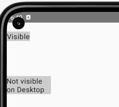
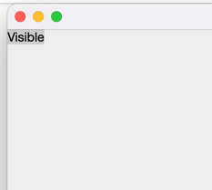

# Reproduce bug with offset{ IntOffset }
https://github.com/JetBrains/compose-jb/issues/2198

 - This sample works good on Android.  

 - On Desktop second label not shown.  

Look at file [ReproduceOffsetBug.kt](common%2Fsrc%2FcommonMain%2Fkotlin%2Fcom%2Fexample%2Fcommon%2FReproduceOffsetBug.kt)  
`./gradlew desktop:run`

